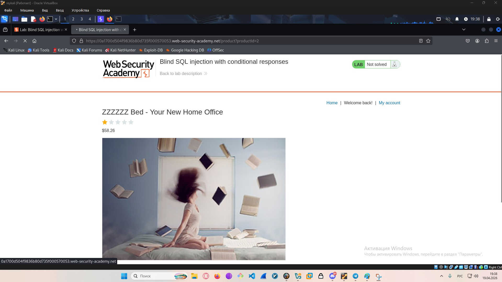
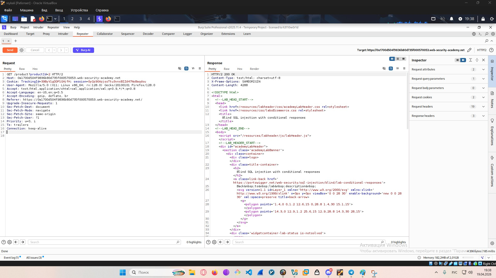
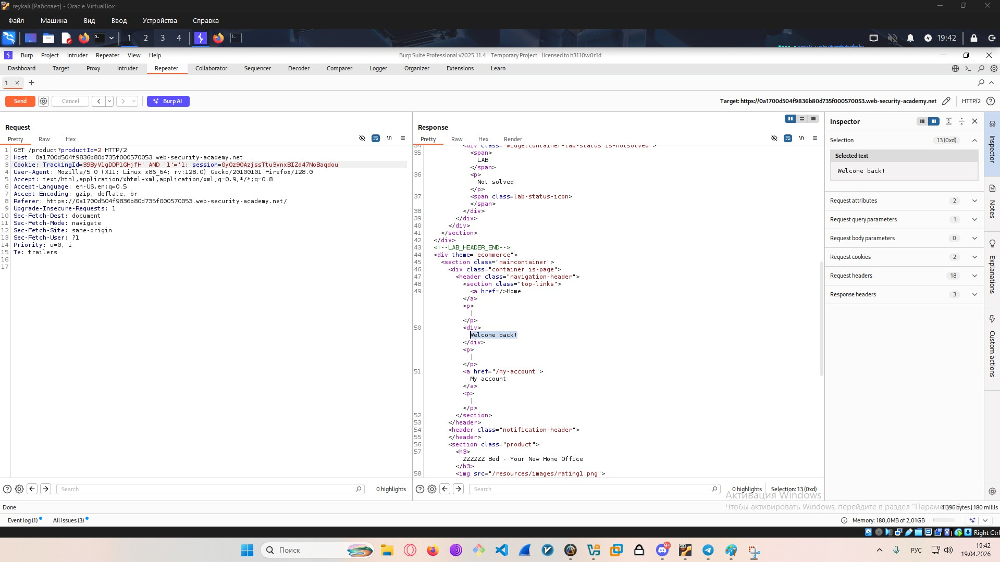
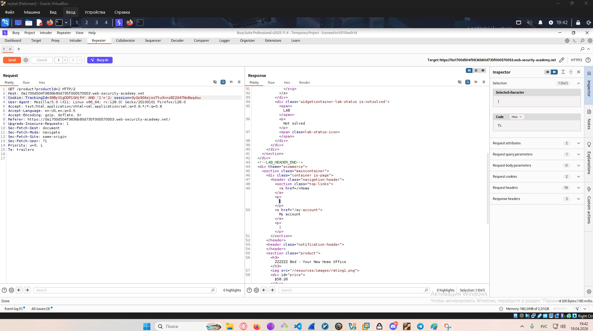
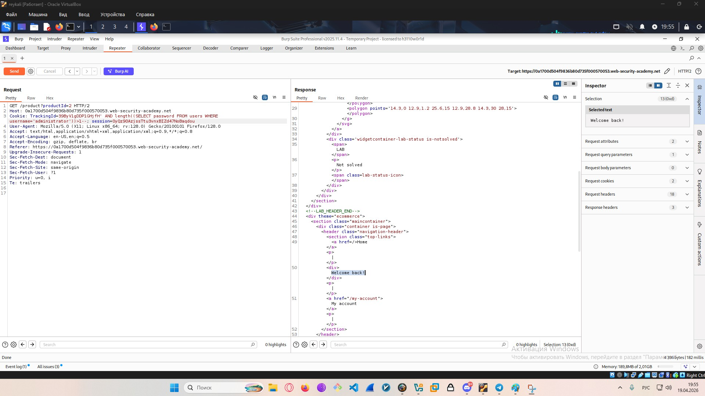
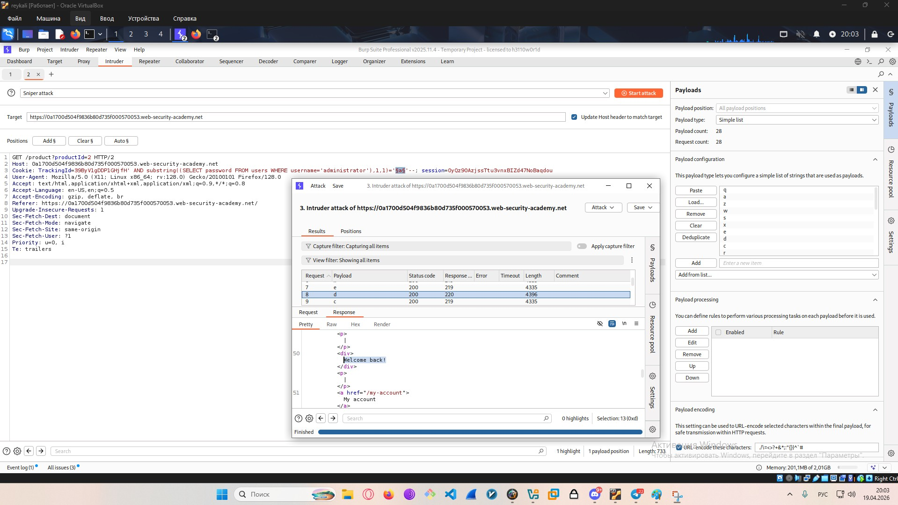
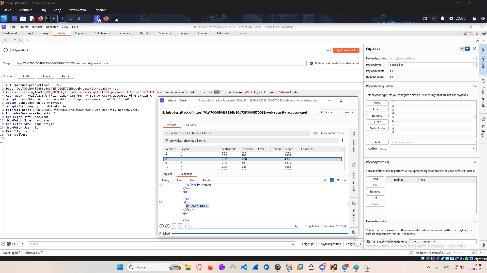
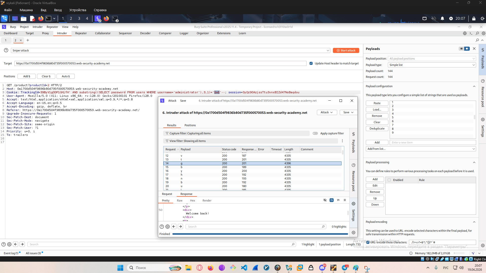
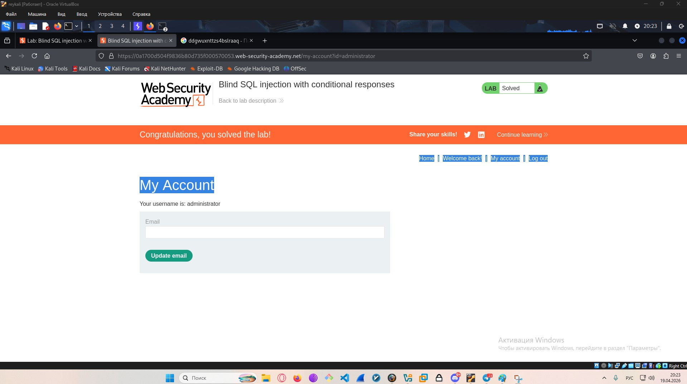

Lab: Blind SQL injection with conditional responses
Link:https://portswigger.net/web-security/sql-injection/blind/lab-conditional-responses

1. Lab Description:

This lab contains a blind SQL injection vulnerability. The application uses a tracking cookie for analytics, and performs a SQL query containing the value of the submitted cookie. 

The results of the SQL query are not returned, and no error messages are displayed. But the application includes a Welcome back message in the page if the query returns any rows. 

The database contains a different table called users, with columns called username and password. You need to exploit the blind SQL injection vulnerability to find out the password of the administrator user. To solve the lab, log in as the administrator user. 

2. Analytics

I went to the website and tried to view the details of one of the products.

First, you need to intercept the GET request to understand where to start

We see a suspicious parameter in the cookies. Specifically, a custom cookie in TrackingID, which could potentially be vulnerable to SQL injection

3. Initialization of the vulnerability

Let's try to determine the type of SQL injection. We'll inject the following payload into TrackingID: ‘ AND ‘1’=’1—

We see that a div tag with the text 'Welcome back!' has appeared on the page. We should check how the page changes if we use a deliberately false condition.

"As we can see, the block with the text has disappeared, which tells us that this is a Boolean-based SQL injection. This means we can try to find out the administrator's password.

4. Info before exploitation

Let's inject our code into TrackingId to find out the length of the admin account password.
‘ AND length((SELECT password FROM users WHERE username=’administrator’))>1—

As we can see, our password is definitely longer than 1 character, and when the condition is true, the 'Welcome back' text appears on the page. This allows us to fully confirm the success of our vulnerability.

' AND length((SELECT password FROM users WHERE username='administrator'))>19--
' AND length((SELECT password FROM users WHERE username='administrator'))>20--

By changing 1 to 19 and then to 20, we will understand that the password consists of 20 characters.

5. Exploitation

Let's start discovering our password. To do this, we'll need to be patient — we send our request to Burp Intruder to speed up the password brute-forcing process as much as possible. We replace the previous code with the following string:

' AND substring((SELECT password FROM users WHERE username='administrator'),1,1)='a'--

(It should be noted that after the opening parenthesis, the first '1' indicates the starting position of the substring, and the second '1' indicates the number of characters. In our case, we are taking a single character and comparing it to another single character.)

Burp Intruder is very useful in this situation and significantly speeds up the brute-forcing process. We choose Sniper attack, highlight our variable 'a' for brute-forcing, and select a list of lowercase letters and digits to be substituted in.

When we launch our attack, we can notice that the correct letter will produce the longest response length, and by looking at the response we will see our 'Welcome back' banner, confirming that the password starts with the letter 'd'. 

We will continue the same process, only changing the number in our payload from 1 to 2 (and so on up to 20), gradually collecting the entire password.

Having collected the entire password in this way, we try to log in as admin.

Hooray, we were able to log in as admin and received a notification that the lab is solved.